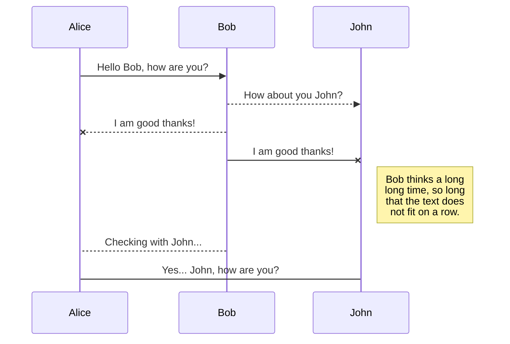
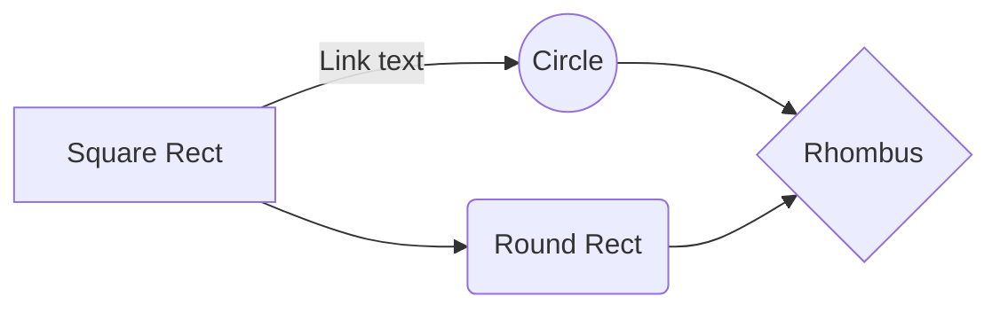

# Dactylo-chute
Mini projet de FISE1 à Télécom Saint-Etienne

## UML diagrams
Possibilité d'afficher des diagrames uml ici même en générant avec [stackedit](
(stackedit.io) ) , cf [Mermaid](https://mermaidjs.github.io/).

...et des flow chart:

